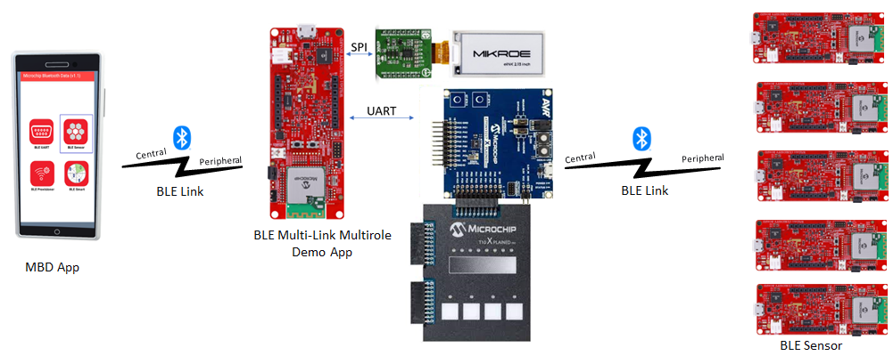

# WBZ45x BLE Sensor Multi-Link Multi-Role Demo

> "Wireless Made Easy!" 

Devices: **| PIC32CXBZ2 | WBZ45x | ATtiny3217 Xplained Pro |** 
Features: **| BLE | TOUCH | E-PAPER |**

## ⚠ Disclaimer

<b>
THE SOFTWARE ARE PROVIDED "AS IS" AND GIVE A PATH FOR SELF-SUPPORT AND SELF-MAINTENANCE. This repository contains example code intended to help accelerate client product development.  

For additional Microchip repos, see: <a href="https://github.com/Microchip-MPLAB-Harmony" target="_blank">https://github.com/Microchip-MPLAB-Harmony</a>

Checkout the <a href="https://microchipsupport.force.com/s/" target="_blank">Technical support portal</a> to access our knowledge base, community forums or submit support ticket requests.

</b>

## Contents

1. [Introduction](#step1)
1. [Bill of materials](#step2)
1. [Hardware Setup](#step3)
1. [Software Setup](#step4)
1. [Harmony MCC Configuration](#step5)
1. [ATtiny3217 Touch Application Code](#step6)
1. [Board Programming](#step7)
1. [Run the demo](#step8)

## 1. Introduction<a name="step1">

This application demonstrates the multi-link & multi-role capability of PIC32CXBZ2/WBZ45x device. The PIC32CXBZ2/WBZ45x device allows 6 simultaneous BLE connections.
 
In this Demo, 'WBZ451 Multi-Role device' act as a central device on startup and scan for [BLE Sensor](https://github.com/Microchip-MPLAB-Harmony/wireless_apps_pic32cxbz2_wbz45) devices nearby. The 'WBZ451 Multi-Role device' initiates connections to 5 [BLE Sensor](https://github.com/Microchip-MPLAB-Harmony/wireless_apps_pic32cxbz2_wbz45) devices.  The 'WBZ451 Multi-Role device' also act a Peripheral device and advertise as a BLE sensor device. The MBD App scans and connect to 'WBZ451 Multi-Role device' and the RGB LED's on all connected devices can be controlled by MBD App. 

The WBZ451 Multi-Role demo application also features a touch interface and a E-Paper Display using through [ATtiny3217 Xplained Pro](https://www.microchip.com/en-us/development-tool/ATTINY3217-XPRO) - [T10 Xplained Pro kit](https://www.microchip.com/en-us/development-tool/AC47H23A) and [E-Paper Bundle 2 ](https://www.mikroe.com/e-paper-bundle-2). The Temperature data received from BLE Sensor devices are displayed on the E-Paper Display.

## 2. Bill of materials<a name="step2">

| TOOLS | QUANTITY |
| :- | :- |
| [PIC32CX-BZ2 and WBZ451 Curiosity Development Board](https://www.microchip.com/en-us/development-tool/EV96B94A) | 6 |
| [E-Paper Bundle 2](https://www.mikroe.com/e-paper-bundle-2) | 1 |
| [ATtiny3217 Xplained Pro](https://www.microchip.com/en-us/development-tool/ATTINY3217-XPRO) | 1 |
| [T10 Xplained Pro Extension Kit](https://www.microchip.com/en-us/development-tool/AC47H23A) | 1 |
| Smart Phone (Android / Apple® iPhone) | 1 |

## 3. Hardware Setup<a name="step3">

- Connect the E-Paper Bundle 2 with the WBZ451 CURIOSITY BOARD using the below table.

|WBZ451|E-PAPER |Description |WBZ451|E-PAPER|Description|
| :- | :- | :- | :- |:- | :- |
|AN|15(BSY)|BUSY|PWM|16(D/C)|Data/Command|
|RST|2(RST)|RESET|INT|NC|NC|
|CS|3(CS)|CHIP SELECT|RX|NC|NC|
|SCK|4(SCK)|SPI CLOCK|TX|NC|NC|
|MISO|NC|NC|SCL|NC|NC|
|MOSI|6(MOSI)|SERIAL DATA INPUT|SDA|NC|NC|
|3.3V|7(3.3V)|POWER SUPPLY|5V|NC|NC|
|GND|8(GND)|GROUND|GND|9(GND)|GROUND|

| Note: PIN 15 (BSY) of E-PAPER should be connected with AN of WBZ451 !! |
| --- |

- Connect T10 Extension header 3 (EXT3) to ATtiny3217 Xplained Pro  Extension Header 1 (EXT1).
- Connect the External 3 header of ATtiny3217 Xplained Pro touch interface with the WBZ451 Curiosity board using jumper wires as shown in the table below.

|ATtiny3217 Xplained Pro+T10 Xplained Pro|Description|WBZ451 |Description|
| :- | :- | :- | :- |
|PB3|UART-RX|PA13(SDA)|Sercom2-UART-TX|
|PB2|UART-TX|PA14(SCL)|Sercom2-UART-RX|
|3.0V IN|Power supply|3V|Power supply|
|GND|Ground|GND|Ground|

| Note: Make sure to have common GND! |
| --- |

## 4. Software Setup<a name="step4">

- [MPLAB X IDE ](https://www.microchip.com/en-us/tools-resources/develop/mplab-x-ide#tabs)

    - Version: 6.05
	- XC32 Compiler v4.10
	- MPLAB® Code Configurator v5.1.17
	- PIC32CX-BZ_DFP v1.0.116
	- MCC Harmony
	  - csp version: v3.14.0
	  - core version: v3.11.1
	  - wireless_pic32cxbz_wbz: v1.1.0
	  - wireless_ble: v1.0.0	  
	  - wireless_system_pic32cxbz_wbz: v1.1.0
	  - dev_packs: v3.14.0
	  - wolfssl version: v4.7.0
	  - crypto version: v3.7.6
	  - CMSIS-FreeRTOS: v10.4.6
	    
- Any Serial Terminal application like [TERA TERM](https://download.cnet.com/Tera-Term/3000-2094_4-75766675.html) terminal application

- [MPLAB X IPE v6.05](https://microchipdeveloper.com/ipe:installation)

## 5. Harmony MCC Configuration<a name="step5">

### Getting started with Thermostat application with WBZ451 CURIOSITY BOARD.

| Tip | New users of MPLAB Code Configurator are recommended to go through the [overview](https://onlineDocs.microchip.com/pr/GUID-1F7007B8-9A46-4D03-AEED-650357BA760D-en-US-6/index.html?GUID-AFAB9227-B10C-4FAE-9785-98474664B50A) |
| :- | :- |

**Step 1** - Connect the WBZ451 CURIOSITY BOARD to the device/system using a micro-USB cable.

**Step 2** - The project graph of the application is shown below.

## 6. Board Programming<a name="step6">

## Programming hex file:

### Program the precompiled hex file using MPLAB X IPE

- The Precompiled hex file is given in the hex folder.
Follow the steps provided in the link to [program the precompiled hex file](https://microchipdeveloper.com/ipe:programming-device) using MPLABX IPE to program the pre-compiled hex image. 

### Build and program the application using MPLAB X IDE

The application folder can be found by navigating to the following path: 

- "PIC32CXBZ2_WBZ45x_BLE_SENSOR_Multi-role\ble_sensor_multirole\firmware\ble_sensor_multirole.X"

Follow the steps provided in the link to [Build and program the application](https://github.com/Microchip-MPLAB-Harmony/wireless_apps_pic32cxbz2_wbz45/tree/master/apps/ble/advanced_applications/ble_sensor#build-and-program-the-application-guid-3d55fb8a-5995-439d-bcd6-deae7e8e78ad-section).

## 7. Run the demo<a name="step7">
