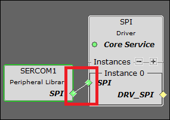
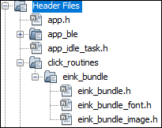

# WBZ45x BLE Sensor Multi-Link Multi-Role Demo


> "Wireless Made Easy!" 

Devices: **| PIC32CXBZ2 | WBZ45x | ATtiny3217 Xplained Pro |**<br>
Features: **| BLE | TOUCH | E-PAPER |**


## ⚠ Disclaimer

<p><span style="color:red"><b>
THE SOFTWARE ARE PROVIDED "AS IS" AND GIVE A PATH FOR SELF-SUPPORT AND SELF-MAINTENANCE. This repository contains example code intended to help accelerate client product development. </br>

For additional Microchip repos, see: <a href="https://github.com/Microchip-MPLAB-Harmony" target="_blank">https://github.com/Microchip-MPLAB-Harmony</a>

Checkout the <a href="https://microchipsupport.force.com/s/" target="_blank">Technical support portal</a> to access our knowledge base, community forums or submit support ticket requests.
</span></p></b>

## Contents

1. [Introduction](#step1)
1. [Bill of materials](#step2)
1. [Hardware Setup](#step3)
1. [Software Setup](#step4)
1. [Harmony MCC Configuration](#step5)
1. [ATtiny3217 Touch Application Code](#step6)
1. [Board Programming](#step7)
1. [Run the demo](#step8)

## 1. Introduction<a name="step1">

This application demonstrates the multi-link & multi-role capability of PIC32CXBZ2/WBZ45x device. The PIC32CXBZ2/WBZ45x device allows 6 simultaneous BLE connections.
 
In this Demo, 'WBZ451 Multi-Role device' act as a central device on startup and scan for [BLE Sensor](https://github.com/Microchip-MPLAB-Harmony/wireless_apps_pic32cxbz2_wbz45/tree/master/apps/ble/advanced_applications/ble_sensor) devices nearby. The 'WBZ451 Multi-Role device' initiates connections to 5 [BLE Sensor](https://github.com/Microchip-MPLAB-Harmony/wireless_apps_pic32cxbz2_wbz45/tree/master/apps/ble/advanced_applications/ble_sensor) devices.  The 'WBZ451 Multi-Role device' also act a Peripheral device and advertise as a BLE sensor device. The MBD App scans and connect to 'WBZ451 Multi-Role device' and the RGB LED's on all connected devices can be controlled by MBD App. 


The WBZ451 Multi-Role demo application also features a touch interface and a E-Paper Display using through [ATtiny3217 Xplained Pro](https://www.microchip.com/en-us/development-tool/ATTINY3217-XPRO) - [T10 Xplained Pro kit](https://www.microchip.com/en-us/development-tool/AC47H23A) and [E-Paper Bundle 2 ](https://www.mikroe.com/e-paper-bundle-2). The Temperature data received from BLE Sensor devices are displayed on the E-Paper Display.


## 2. Bill of materials<a name="step2">

| TOOLS | QUANTITY |
| :- | :- |
| [PIC32CX-BZ2 and WBZ451 Curiosity Development Board](https://www.microchip.com/en-us/development-tool/EV96B94A) | 6 |
| [E-Paper Bundle 2](https://www.mikroe.com/e-paper-bundle-2) | 1 |
| [ATtiny3217 Xplained Pro](https://www.microchip.com/en-us/development-tool/ATTINY3217-XPRO) | 1 |
| [T10 Xplained Pro Extension Kit](https://www.microchip.com/en-us/development-tool/AC47H23A) | 1 |
| Smart Phone (Android / Apple® iPhone) | 1 |

## 3. Hardware Setup<a name="step3">

- Connect the E-Paper Bundle 2 with the WBZ451 CURIOSITY BOARD using the below table.

|WBZ451|E-PAPER |Description |WBZ451|E-PAPER|Description|
| :- | :- | :- | :- |:- | :- |
|AN|15(BSY)|BUSY|PWM|16(D/C)|Data/Command|
|RST|2(RST)|RESET|INT|NC|NC|
|CS|3(CS)|CHIP SELECT|RX|NC|NC|
|SCK|4(SCK)|SPI CLOCK|TX|NC|NC|
|MISO|NC|NC|SCL|NC|NC|
|MOSI|6(MOSI)|SERIAL DATA INPUT|SDA|NC|NC|
|3.3V|7(3.3V)|POWER SUPPLY|5V|NC|NC|
|GND|8(GND)|GROUND|GND|9(GND)|GROUND|

| Note: PIN 15 (BSY) of E-PAPER should be connected with AN of WBZ451 !! |
| --- |

- Connect T10 Extension header 3 (EXT3) to ATtiny3217 Xplained Pro  Extension Header 1 (EXT1).
- Connect the External 3 header of ATtiny3217 Xplained Pro touch interface with the WBZ451 Curiosity board using jumper wires as shown in the table below.

|ATtiny3217 Xplained Pro+T10 Xplained Pro|Description|WBZ451 |Description|
| :- | :- | :- | :- |
|PB3|UART-RX|PA13(SDA)|Sercom2-UART-TX|
|PB2|UART-TX|PA14(SCL)|Sercom2-UART-RX|
|3.0V IN|Power supply|3V|Power supply|
|GND|Ground|GND|Ground|

| Note: Make sure to have common GND! |
| --- |

## 4. Software Setup<a name="step4">

- [MPLAB X IDE ](https://www.microchip.com/en-us/tools-resources/develop/mplab-x-ide#tabs)

    - Version: 6.05
	- XC32 Compiler v4.10
	- MPLAB® Code Configurator v5.1.17
	- PIC32CX-BZ_DFP v1.0.116
	- MCC Harmony
	  - csp version: v3.14.0
	  - core version: v3.11.1
	  - wireless_pic32cxbz_wbz: v1.1.0
	  - wireless_ble: v1.0.0	  
	  - wireless_system_pic32cxbz_wbz: v1.1.0
	  - dev_packs: v3.14.0
	  - wolfssl version: v4.7.0
	  - crypto version: v3.7.6
	  - CMSIS-FreeRTOS: v10.4.6
	    
- Any Serial Terminal application like [TERA TERM](https://download.cnet.com/Tera-Term/3000-2094_4-75766675.html) terminal application

- [MPLAB X IPE v6.05](https://microchipdeveloper.com/ipe:installation)

## 5. Harmony MCC Configuration<a name="step5">

### Getting started with Thermostat application with WBZ451 CURIOSITY BOARD.

| Tip | New users of MPLAB Code Configurator are recommended to go through the [overview](https://onlineDocs.microchip.com/pr/GUID-1F7007B8-9A46-4D03-AEED-650357BA760D-en-US-6/index.html?GUID-AFAB9227-B10C-4FAE-9785-98474664B50A) |
| :- | :- |

**Step 1** - Connect the WBZ451 CURIOSITY BOARD to the device/system using a micro-USB cable.

**Step 2** - This application is built by using [BLE Sensor with with ATTINY3217 Touch Application](https://github.com/MicrochipTech/PIC32CXBZ2_WBZ45x_BLE_SENSOR_Touch_ATtiny3217) as the building block. The project graph of the BLE Sensor Multi-Link Multi-Role Demo application is shown below.


**Step 2** - In MCC harmony project graph, Add the SERCOM1 component under Libraries->Harmony->Peripherals->SERCOM->SERCOM1. select SERCOM1 and add "SPI" satisfiers by right click on the "⬦" near SPI to add the SPI component which will prompt an Auto-activation for "core"&"FreeRTOS" component, give yes to add the component and configure SERCOM1 and SPI as shown below. 




**Step 3** - In MCC harmony project graph, Update Transparent profile from device resources under Libraries->Harmony->wireless->drivers->BLE->Profiles and configure as shown below.


**Step 4** - In MCC harmony project graph, select system and configure as shown below.


**Step 5** - In project graph, go to Plugins->Pin configurations->Pin settings and set the pin configuration as shown below.

- Use these PIN Names while configuring.

```
CLICK_EINK_BUNDLE_CS
CLICK_EINK_BUNDLE_DC
CLICK_EINK_BUNDLE_RST
CLICK_EINK_BUNDLE_BSY
```


**Step 6** - [Generate](https://onlinedocs.microchip.com/pr/GUID-A5330D3A-9F51-4A26-B71D-8503A493DF9C-en-US-1/index.html?GUID-9C28F407-4879-4174-9963-2CF34161398E) the code.

**Step 7** - Copy the folder click_routines(which contains the eink_bundle.h, eink_bundle_font.h, eink_bundle_image.h, eink_bundle.c,  eink_bundle_font.c, eink_bundle_image.c) to the folder firmware/src under your MPLAB Harmony v3 application project and add the Header (eink_bundle.h, eink_bundle_font.h, eink_bundle_image.h) and Source file (eink_bundle.c, eink_bundle_font.c, eink_bundle_image.c).

- In the project explorer, Right click on folder Header Files and add a sub folder click_routines by selecting “Add Existing Items from Folders…”


- Click on “Add Folder…” button.


- Select the “click_routines” folder and select “Files of Types” as Header Files.


- Click on “Add” button to add the selected folder.


- The eink bundle header files gets added to your project.



- In the project explorer, Right click on folder Source Files and add a sub folder click_routines by selecting “Add Existing Items from Folders…”.


- Click on “Add Folder…” button


- Select the “click_routines” folder and select “Files of Types” as Source Files.


- Click on “Add” button to add the selected folder


- The eink bundle source files gets added to your project.


- The click_routines folder contain an C source file eink_bundle.c. You could use eink_bundle.c as a reference to add E-Paper display functionality to your application.

**Step 8** - In "app_user_edits.c", make sure the below code line is commented and make changes as mentioned in TODO section

- "#error User action required - manually edit files as described here".

**Step 9** - Replace the app.c, app_ble_sesnor.c, app_ble_conn_handler.c, app_ble_conn_handler.h, app_trpc.c, app_trpc.h, app_ble.c, app_ble_handler.c and app.h file.

| Note | This application repository should be cloned/downloaded to perform the following steps. |
| :- | :- |
| Path | The application folder can be found in the following [link](https://github.com/MicrochipTech/PIC32CXBZ2_WBZ45x_BLE_SENSOR_Multi-Role/tree/main/ble_sensor_multirole/firmware) |

**Step 10** - Clean and build the project. To run the project, select "Make and program device" button.

## 6. ATtiny3217 Touch Application <a name="step6">

- Follow the steps provided under [program the precompiled hex file](https://github.com/MicrochipTech/PIC32CXBZ2_WBZ45x_BLE_SENSOR_Multi-Role#7-board-programming) section to program the ATtiny3217 Xplained Pro and T10 Xplained Pro interface.
- To create the Atmel Start project from scratch follow steps provided in this [link](https://github.com/MicrochipTech/PIC32CXBZ2_WBZ45x_BLE_SENSOR_Multi-Role/tree/main/ATTiny3217_T10#attiny3217-touch-demo).

## 7. Board Programming<a name="step7">

### Program the precompiled hex file using MPLAB X IPE

The application hex files can be found by navigating to the following paths: 
- "PIC32CXBZ2_WBZ45x_BLE_SENSOR_Multi-Role/hex/ble_sensor_multirole.X.production.signed.unified.hex"
- "PIC32CXBZ2_WBZ45x_BLE_SENSOR_Multi-Role/hex/ATiny3217_T10.hex"

Program five WBZ451 boards with [BLE Sensor Application](https://github.com/Microchip-MPLAB-Harmony/wireless_apps_pic32cxbz2_wbz45/tree/master/apps/ble/advanced_applications/ble_sensor). The application hex files can be found by navigating to the following paths:
- "wireless_apps_pic32cxbz2_wbz45/apps/ble/advanced_applications/ble_sensor/precompiled_hex/ble_sensor.X.production.signed.unified_timerbased.hex"

| Note: Ensure that all the WBZ451 WBZ451 Curiosity boards have unique BLE MAC Address. If not, program the boards with unique BLE MAC Address.|
| --- |

Follow the steps provided in the link to [program the precompiled hex file](https://microchipdeveloper.com/ipe:programming-device) using MPLABX IPE to program the pre-compiled hex image. 

### Build and program the application using MPLAB X IDE

The application folders can be found by navigating to the following paths: 
- "PIC32CXBZ2_WBZ45x_BLE_SENSOR_Multi-Role/tree/main/ble_sensor_multirole/firmware/ble_sensor_multirole.X"
- "PIC32CXBZ2_WBZ45x_BLE_SENSOR_Multi-Role/tree/main/ATTiny3217_T10"

Follow the steps provided in the link to [Build and program the application](https://github.com/Microchip-MPLAB-Harmony/wireless_apps_pic32cxbz2_wbz45/tree/master/apps/ble/advanced_applications/ble_sensor#build-and-program-the-application-guid-3d55fb8a-5995-439d-bcd6-deae7e8e78ad-section).

## 8. Run the demo<a name="step8">

- After programming the board, the expected application behavior is shown in the below [video](https://github.com/MicrochipTech/PIC32CXBZ2_WBZ45x_BLE_SENSOR_Multi-Role/blob/main/docs/Working_Demo.gif).


- On Startup the WBZ451 Device will scan for nearby BLE Sensor devices and initiates connection with them. During scanning, the user LED will blink at every 500ms.
- To switch the device between Advertising and Scanning, press the user button. During Advertising the user LED will blink at every 1000ms.
- The E-Paper Display will show the temperature of all the connected devices every 60 seconds. 